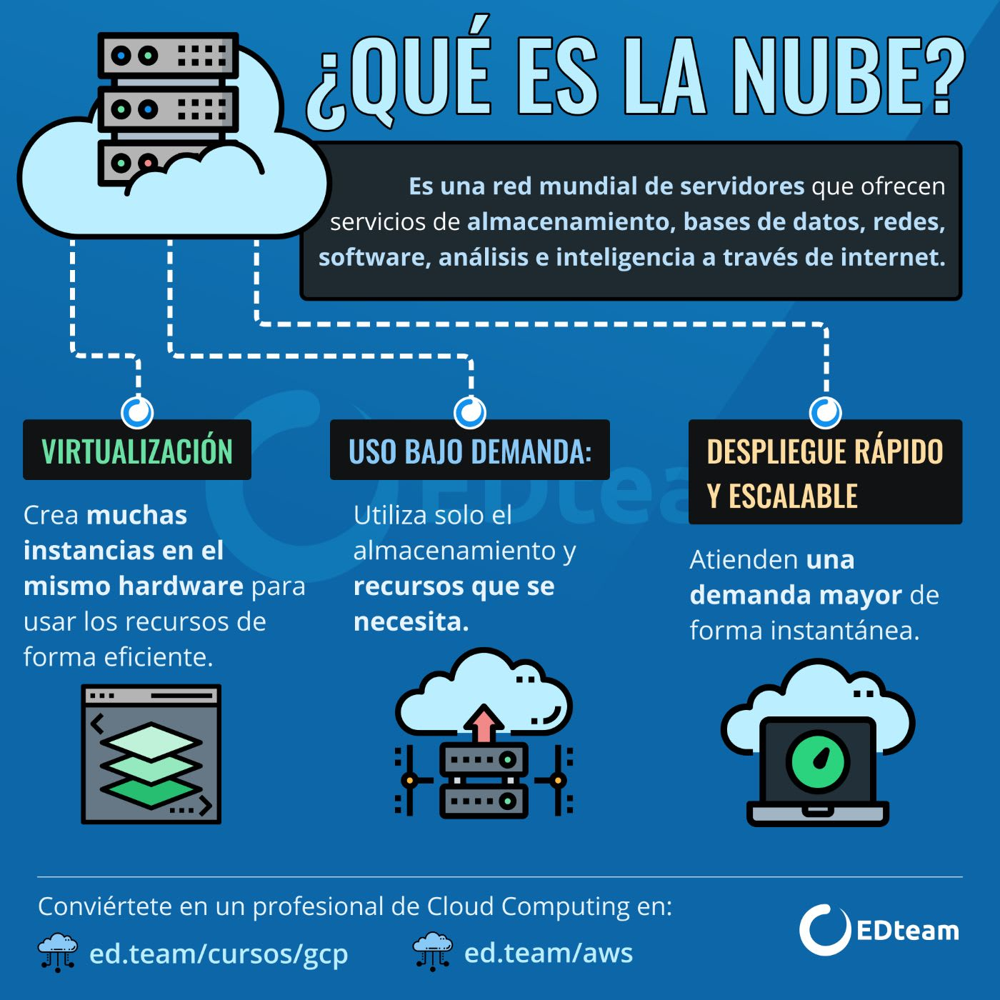
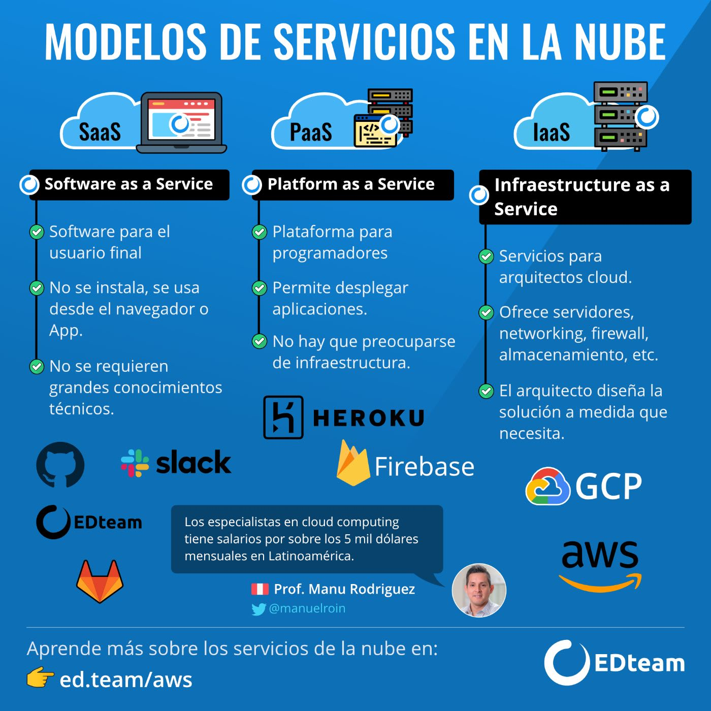

# SUMMER CLOUD APUNTES

## Summer Cloud Cracks TEAM!

## Integrantes
- Sergio Manuel López
- Ilai Alanis
- José Armando Díaz
- Paola Salas
- Jonathan Alexis Bello López

## Introducción a Azure

### ¿Qué es Azure?
Es una plataforma de informática en la nube con un conjunto de servicios que sirve para ayudarle a crear soluciones que satisfagan los objetivos empresariales.
Azure proporciona una gran cantidad de servicios basados en la nube, como el almacenamiento remoto, el hospedaje de bases de datos y la administración centralizada de cuentas.

## ¿Qué es la informática en la nube?

Es la entrega de servicios informáticos a través de Internet, lo que se conoce como la nube. Estos servicios incluyen servidores, almacenamiento, bases de datos, redes, software, análisis e inteligencia. La informática en la nube ofrece una innovación más rápida, recursos flexibles y economías de escala.
Beneficios de usar la informática en la nube:

- Reducir los costos operativos.
- Ejecutar la infraestructura de forma más eficaz.
- Escalar a medida que cambien las necesidades empresariales.

Dicho de otro modo, la informática en la nube es una forma de alquilar potencia de proceso y almacenamiento de un centro de datos de terceros. Los recursos de la nube se pueden tratar igual que los recursos de un centro de datos propio. Cuando haya terminado con ellos, solo hay que devolverlos. Únicamente se le cobrará por lo que use.

## ¿Qué puedo hacer con Azure?

Azure proporciona más de cien servicios que permiten hacer todo tipo de cosas: desde ejecutar las aplicaciones existentes en máquinas virtuales hasta explorar nuevos paradigmas de software, como bots inteligentes y realidad mixta.

## ¿Qué es Azure Portal?

Azure Portal es una consola unificada basada en web que proporciona una alternativa a las herramientas de línea de comandos. Con Azure Portal, puede administrar la suscripción de Azure mediante una interfaz gráfica de usuario. Puede:

- Compile, administre y supervise todo, desde aplicaciones web sencillas hasta complejas implementaciones en la nube.
- Cree paneles personalizados para una vista organizada de recursos.
- Configure opciones de accesibilidad para una experiencia óptima.

Azure Portal está diseñado para proporcionar resistencia y disponibilidad continua. Mantiene una presencia en todos los centros de datos de Azure.

## Componentes de la arquitectura de Azure

Antes de comenzar a describir la arquitectura, vamos a describir los siguientes conceptos para poder comprender mejor este tema:
- Recursos: Son los recursos son instancias de servicios creados, como máquinas virtuales, almacenamiento o bases de datos SQL.
- Grupos de recursos: Los recursos se combinan en grupos de recursos, que actúan como un contenedor lógico en el que se implementan y administran recursos de Azure.
- Suscripciones: Estas se refieres a las cuentas de usuario y los recursos que han sido creados por los usuarios. Para cada suscripción, existen límites y/o cuotas en la cantidad de recursos que se lleguen a usar. Una cuenta puede tener una suscripción o varias suscripciones que tienen diferentes modelos de facturación y a las que se aplican diferentes políticas de administración de acceso. Puede usar las suscripciones de Azure para definir límites en torno a los productos, servicios y recursos de Azure.
- Grupos de administración: Ayudan a administrar el acceso, la política y el cumplimiento de las suscripciones. 
 

Dicho esto, podemos continuar con la descripción de los componentes, los cuales son:
 - **Regiones de Azure**
 
 Las regiones de Azure son un conjunto de centros de datos implementados dentro de un perímetro definido por latencia, y se conectan a través de una red de baja latencia. Actualmente hay 42 regiones disponibles en todo el mundo.

  
 - **Regiones de emparejamiento**
 
Como ya sabemos Microsoft opera centros de datos todo el mundo, esto incluye a Azure que cuenta con muchas ubicaciones diferentes. Una ubicación en Azure se refiere a un área donde se encuentra al menos una región de Azure. Una región de Azure se refiere a un área dentro de una geografía que contiene uno o más centros de datos de Azure.
 
Para facilitar la alta disponibilidad, cada región de Azure se empareja con otra región que se encuentra cerca. Este emparejamiento se denomina "regional pair". 
Los "regional pair" permiten que Azure serialice las actualizaciones de la plataforma y el mantenimiento planificado. 

 - **Regiones disponibles**
 
 Availability Zones es una oferta de Azure que se utiliza para proteger las aplicaciones y los centros de datos de las fallas del centro de datos. Cada zona de disponibilidad es una ubicación física única dentro de una región de Azure, y cada zona es compatible con uno o más centros de datos. 
Las zonas de disponibilidad son centros de datos físicamente separados dentro de una región de Azure. Cada zona de disponibilidad se compone de uno o más centros de datos equipados con alimentación, refrigeración y redes independientes. Si una zona se cae, la otra sigue funcionando.  
Cada zona de disponibilidad dentro de una región de Azure se compone de una combinación de dominios de error y dominios de actualización. 
Se pueden utilizar las zonas de disponibilidad para ejecutar aplicaciones con un trabajo crítico y crear alta disponibilidad en la arquitectura de su aplicación colocando sus recursos informáticos, de almacenamiento, de red y de datos dentro de una zona y replicando en otras zonas.  
Las zonas de disponibilidad son principalmente para máquinas virtuales, discos administrados, balanceadores de carga y bases de datos SQL. Los servicios de Azure que admiten zonas de disponibilidad se dividen en dos categorías: Servicios de zona y Servicios con redundancia de zona. 

 
 - **Grupo de recursos**
 
 Los grupos de recursos son contenedores lógicos en Azure. Contienen recursos de Azure relacionados que forman parte de una solución de Azure más grande. Estos grupos de recursos pueden hospedar todos los recursos que componen una solución de Azure, o también pueden hospedar solo los recursos que deben administrarse como parte de un grupo.
 
Al trabajar con grupos de recursos de Azure, hay algunas cosas a considerar, como por ejemplo, dado que todos los recursos dentro de un solo grupo de recursos generalmente comparten un ciclo de vida similar, es importante determinar el ciclo de vida de los recursos que planea colocar en un solo grupo de recursos. 

 
 - **Administrador de recursos**
  
 Dentro de Azure, existen varios componentes que proporcionan la infraestructura para una aplicación o servicio que se ha implementado en Azure. 
Debido a que todas estas partes funcionan juntas para brindar una solución, generalmente se implementan, administran y monitorean todos estos recursos como un grupo. El administrador de recursos es una herramienta que le permite trabajar con todos los recursos subyacentes que forman parte de una solución como grupo. Con el administrador de recursos, puede implementar, actualizar e incluso eliminar todos los recursos que forman una solución en una sola operación coordinada.

# Introducción a aspectos básicos de Azure

## ¿Qué es la nube?

La nube se refiere a la entrega de servicios informáticos a través de internet, estos pueden ser:

- Almacenamiento
- Bases de datos
- Redes de software
- Inteligencia Artificial
- Análisis de datos

Y sus principales ventajas es el ahorro económico generado para los consumidores y creadores de soluciones. Lo barato del costo se debe a que solo pagas lo que usas por lo general. De esta manera si tienes por ejemplo pocos usuarios solo vas a pagar lo que consuman ellos.

Y te dejas de preocupar de comprar, mantener y administrar servidores super potentes, ya que Microsoft se encarga de eso dejándote a ti preocuparte de tu emprendimiento o proyecto.

## ¿Por que usar la nube?

El avance de la tecnología es cada vez mas rápido en el mundo actual, lo que provoca que debamos crear soluciones de software de manera rápida y eficiente. Con el computo en la nube no solo dejas de inventar la rueda, sino que tienes a tu alcance soluciones tan complejas como la inteligencia artificial de manera accesible, sin tener que hacer el gasto descomunal para implantarla en tu proyecto.

# Azure

Azure es un servicio de computo en la nube que ofrece Microsoft. Azure ofrece mas de 100 servicios de computo en la nube funciona como una API para todos los servicios que ofrece haciendo la experiencia amena al trabajar con el. Ya que tu solo mediante el uso de formularios e interfaz te encargas de armar todo. Y esta interfaz se le conoce como **Azure portal**.

Desde Azure portal podremos tener un control personalizado de los servicios que hemos solicitado además:

- Tenemos estadísticas de nuestros servicios en tiempo real
- Podemos detener e iniciar desde aquí los procesos.
- Y al ser web podremos acceder a el desde cualquier sitio, y sin tener que estarse molestado con actualizaciones.

## ¿Qué es Azure Marketplace?

Es la sección en la cual Microsoft coloca las soluciones creadas por desarrolladores independientes u terceros para que sean accedidas desde Azure de manera sencilla. Todas estas soluciones están listas para ser probadas o compradas, teniendo el sello de calidad de Microsoft.

Ahora se verán con más detalle las categorías que se usan con más frecuencia:

- Proceso
  - maquina virtual
  - administración de clusters
- Redes
  - Coneción de maquinas virtuales
  - Optimización de granjas de servidores
- Almacenamiento
  - Servicios de almacenamiento de archivos pesados
  - Recursos compartidos
- Móvil
  - Crear servicios de Backend de manera sencilla
  - Sincronización de datos sin conexión
  - Difusión de notificaciones
- Bases de datos
  - Bases de datos distribuidas globalmente
  - Bases de datos posibles
    - SQL
    - MySQL
    - PosgresSQL
    - MariaDB
- Web
  - Creación rápida de aplicaciones en la nube.
  - Notificaciones
  - Publicación de APIs
- Internet de las cosas (IoT)
  - Supervisión global de IoT
  - Centro de mensajeria y comunicaciones seguras
- Macrodatos
  - Analisis de gran escala
  - Procesamiento de gran cantidad de datos
- INTELIGENCIA ARTIFICIAL
  - Marchine learning
  - Identificación de Imágenes y voz
- DevOps
  - Herramienta de colaboración de desarrollado, como GitHub
  - Test rápido de entornos

# Primeros pasos para usar Azure

Para ello debes de crear una cuenta en el sitio web de [Azure](https://azure.microsoft.com/es-mx/free/search/?OCID=AID2200215_SEM_86f47dae4ae816071cbe1d44c2ff25f3:G:s&ef_id=86f47dae4ae816071cbe1d44c2ff25f3:G:s&msclkid=86f47dae4ae816071cbe1d44c2ff25f3).

## Espacio Aislado

Cuando entras a un modulo de practicas Learn, se te permitirá crear lo que se conoce como espacio aislado, este se borrara al terminar la practica o dentro de 4h. Esto nos permite realizar practicas sin costo alguno.

## Paneles de Azure

Un *panel* es una colección personalizable de iconos de interfaz de usuario mostrados en Azure Portal.

# Conceptos fundamentales de Azure

## Tipos de nubes

Existen 3 tipos de nubes que se pueden implementar para realizar soluciones de software.

- Pública: Es aquella como Azure la cual puede ser accedida por cualquier persona para contratar sus servicios
- Privada: Es de exclusivo acceso para la empresa que creo la infraestructura.
- Hibrida: Combina las dos anteriores, permitiendo compartir información entre ellas.

## Comparación de modelos de nube

### Nube pública

- No hay gastos de capital para escalar verticalmente.
- Las aplicaciones pueden aprovisionarse y desaprovisionarse rápidamente.
- Las organizaciones solo pagan por lo que usan.

### Nube privada

- Debe adquirirse hardware para el inicio y el mantenimiento.
- Las organizaciones tienen un control total de los recursos y la seguridad.
- Las organizaciones son responsables del mantenimiento y las actualizaciones del hardware.

### Nube híbrida

- Proporciona la máxima flexibilidad.
- Las organizaciones determinan dónde se van a ejecutar sus aplicaciones.
- Las organizaciones controlan la seguridad, el cumplimiento o los requisitos legales.

## Ventajas de usar la nube

Las principales ventajas del computo en la nube son:

- **Alta disponibilidad**: Nos permite tener menor tiempo de inactividad de nuestros servicios.
- **Escalabilidad**: Permite escalar vertical y horizontalmente
  - Escalabilidad vertical -> aumento de RAM o CPU
  - Escalabilidad horizontal -> aumento de mediante recursos, como Maquinas virtuales
- **Elasticidad**: puedes disponer todos los recursos que necesites
- **Agilidad**: fácilmente configurables
- **Distribución geográfica**: permite escoger las mejores regiones de los centros de datos para optimizar tu proyecto dependiendo de la localización de tu empresa.
- **Recuperación ante desastres**: nos proporciona seguridad de replica de datos para estar protegidos de algún percance.

## Tipos de gastos

Existen dos tipos de gastos importantes a contemplar.

- **Gastos de capital (CapEx)**:  es la inversión realizada en infraestructura física inicial. Este valor disminuye con el tiempo
- **Gastos operativos (OpEx)**: es el dinero invertido en productos o servicios de manera inmediata sin necesidad de costos previos, ya que se paga a medida que se usa.

Los recursos en la nube, se clasifican como **OpEx**. Esto es debido a que la nube se basa en el **modelo basado en consumo** que en pocas palabras es: “Solo pagas por lo que consumes”

> En resumen, CapEx requiere unos costos financieros previos considerables, así como unos gastos continuos de mantenimiento y soporte técnico. En cambio, OpEx es un modelo basado en el consumo, así que solo eres responsable del costo de los recursos informáticos que utiliza.

## Modelos de servicio en la nube

Estos modelos definen los diferentes niveles de responsabilidad compartida de un proveedor de nube y un inquilino de nube.

###  Informática sin servidor

Es la tendencia de la industria a no preocuparse por los aspectos del servidor, y dejárselo a terceros. De esta manera se puede concentrar en resolver y crear las soluciones que se requieran.
